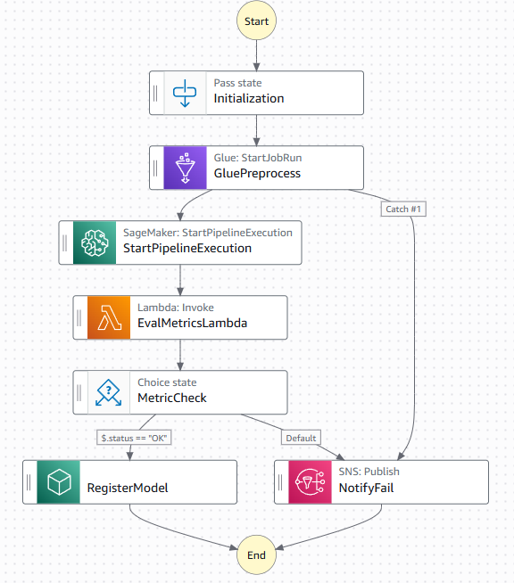
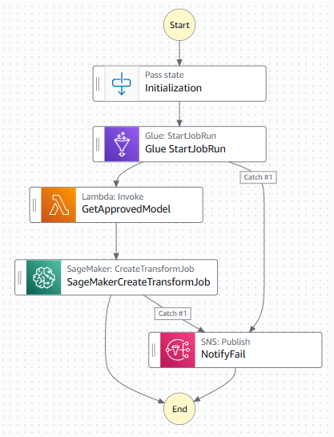

## Estructura general del Pipeline

La solución está dividida en dos flujos independientes gestionados mediante  **AWS Step Functions** :

* **Pipeline de Entrenamiento:** Preprocesamiento de datos, entrenamiento del modelo, validación automática de métricas, registro del modelo en un Model Registry y notificación ante fallos.
* **Pipeline de Inferencia:** Procesa periódicamente nuevos datos usando el modelo más reciente aprobado en el Model Registry para generar predicciones en batch. Incluye alertas automáticas en caso de errores.

Cada flujo cumple con criterios rigurosos de reproducibilidad, automatización, trazabilidad y mantenibilidad.

## Pipeline de Entrenamiento y Despliegue

El pipeline comienza con una etapa de **inicialización** donde se generan automáticamente variables clave como `run_date` y `run_id`. Estas variables permiten el versionado determinístico de cada ejecución y garantizan trazabilidad completa sobre los datos procesados y los modelos generados.

La segunda etapa ejecuta un **proceso de limpieza y preparación** utilizando AWS Glue. Este proceso, ejecutado en modo síncrono (`.sync`), incluye mecanismos automáticos de reintento (`Retry`) y captura de excepciones (`Catch`) con notificación inmediata mediante AWS SNS ante posibles fallos.

Posteriormente, el pipeline continúa con el entrenamiento del modelo mediante una **ejecución automática de un SageMaker Pipeline** (`StartPipelineExecution`). Aquí se encapsula toda la lógica de entrenamiento del modelo. Este paso está protegido contra fallos transitorios mediante un mecanismo automático de reintentos.

Una vez finalizado el entrenamiento, una función **Lambda (`EvalMetricsLambda`) valida automáticamente** las métricas generadas (por ejemplo, `F1-score`). En función del resultado de la validación (`MetricCheck`), el pipeline decide si registrar el modelo en el SageMaker Model Registry para producción, o alertar mediante SNS en caso de no cumplir los estándares definidos.

El pipeline, en caso de registro exitoso, completa su flujo marcando el modelo como apto para ser usado en la inferencia productiva.

## Pipeline de Inferencia Batch 

Este pipeline comienza nuevamente con una etapa de inicialización automática que mantiene coherencia con la estrategia de versionado implementada en el pipeline de entrenamiento.

A continuación, se ejecuta nuevamente el preprocesamiento mediante AWS Glue para garantizar que los datos de entrada para la inferencia sean consistentes y sigan exactamente los mismos criterios usados durante el entrenamiento del modelo.

Luego, una función Lambda específica (`GetApprovedModel`) consulta dinámicamente el SageMaker Model Registry para obtener el ARN del último modelo aprobado para producción, garantizando siempre utilizar la versión más reciente validada del modelo.

Finalmente, se ejecuta un **batch transform** (`CreateTransformJob`) de SageMaker usando este modelo para producir predicciones automáticas sobre el nuevo conjunto de datos preprocesados. Las predicciones son guardadas de manera versionada en un bucket de Amazon S3.

Cualquier error ocurrido durante este flujo (ya sea en Glue o en SageMaker) es capturado y notificado inmediatamente mediante SNS, garantizando alta observabilidad y capacidad de respuesta.

## Estrategia de Reentrenamiento Automático

Para garantizar que el modelo permanezca actualizado y relevante a medida que llegan nuevos datos o cambien las condiciones del entorno, se implementa una estrategia sencilla y efectiva de reentrenamiento automático utilizando Amazon  **EventBridge** .

Se puede por ejemplo crear una regla que cada semana, EventBridge dispara automáticamente la ejecución del pipeline de entrenamiento. Este mecanismo asegura una actualización periódica del modelo con los datos más recientes disponibles.
