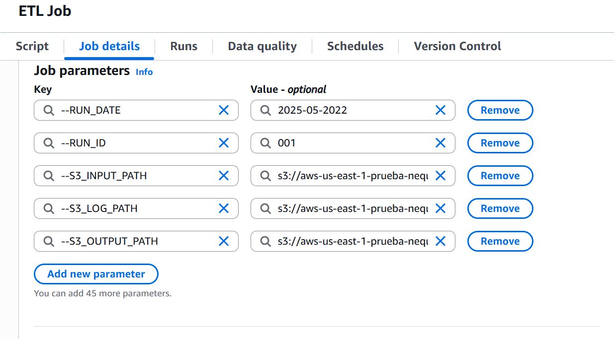
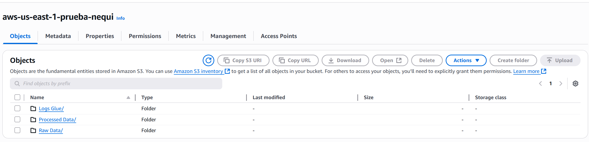
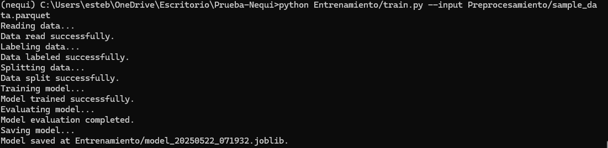
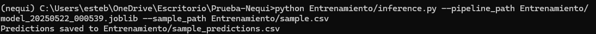

# Prueba-Nequi

En este repositorio se encuentra una propuesta para la solucion del reto de construir una solución de ML en Batch que clasifique mensajes de usuarios enviados a un canal de atención. El entregable de cada una de las implementaciones y retos, se encuentra en el README de cada una de las carpetas, con el respectivo nombre de implementación y/o propuesta. A continuación se procede explicar la selección del dataset:

Se seleccionó el dataset de [mensajes de soporte en Twitter](https://www.kaggle.com/datasets/thoughtvector/customer-support-on-twitter) porque refleja de manera realista el tipo de interacciones, consultas y problemas que los usuarios plantean en canales de atención digital. Este dataset permite simular escenarios similares a los que enfrenta un canal de atención real como Nequi, facilitando el desarrollo y validación de modelos de clasificación que puedan aplicarse a casos de uso productivos.

A continuación se procede dar el paso a paso para la ejecución de los diferentes scripts que hay en el repositorio.

## Instrucciones de Instalación Local

Estas instrucciones te guiarán paso a paso para obtener una copia del proyecto en funcionamiento en tu máquina local.

### Prerrequisitos

Python >= 3.10 (Recomendado).

Para verificar la versión de python. Correr el siguiente script en la terminal.

```bash
python --version
```

### Instalación del proyecto

#### 1. Clonar el repositorio

```bash
git clone https://github.com/britop12/Prueba-Nequi.git
cd Prueba-Nequi
```

#### 2. Configurar el entorno virtual

```bash
python -m venv testNequi
```

##### 2.1 Activar el entorno virtual:

* **En Windows:**

  ```powershell
  .\testNequi\Scripts\activate
  ```
* En Linux o  MacOS:

  ```
  source testNequi/bin/activate
  ```

### 3. Instalación de las dependencias

Una vez activado el entorno virtual, instala las dependencias con el siguiente script:

```bash
pip install -r requirements.txt
```

**Muy Importante!:** Para la ejecución correcta  de la etapa de pre procesamiento, se necesita seguir pasos adicionales para la instalación de PySpark, por lo tanto en esa etapa se recomienda usar el script directamente en AWS Glue, en caso que no se pueda, en el notebook `Preprocesamiento\spark.ipynb` se encuentra el paso a paso de lo que se hace cada una de las operaciones.

## Ejecución del pipeline

### 1. Preprocesamiento

Para el preprocesamiento, se dispone el archivo "Preprocesamiento/ETL.py", el cuál se recomienda ejecutarlo en el ambiente de AWS Glue, ya que el código esta hecho para correr directamente en los Jobs de Glue. Se necesita los siguientes parámetros para la correcta ejecución del script:

* `--RUN_DATE`: Fecha de ejecución en formato yyyy-mm-dd. Por ejemplo: 2025-05-2022
* `--RUN_ID`: Número de ID. Por ejemplo: 001
* `--S3_INPUT_PATH`: Ubicación exacta del dataset. Por ejemplo: "s3://aws-us-east-1-prueba-nequi/Raw Data/twcs.csv"
* `--S3_LOG_PATH`: Ubicación de la carpeta para guardar los logs del resultado de preprocesamiento. Por ejemplo: "s3://aws-us-east-1-prueba-nequi/Logs Glue"
* `--S3_OUTPUT_PATH`: Lugar para guardar los datos preprocesados (Listos para training y/o inferencia). Por ejemplo: "s3://aws-us-east-1-prueba-nequi/Processed Data/"

  

Al ejecutarse correctamente, el bucket de s3 debería quedar de la siguiente forma:


En caso tal que haya inconveniente al momento de ejecutar, se dispone del archivo "Preprocesamiento/sample_data.parquet" el cual contiene una muestra del dataset preprocesada.

### 3. Entrenamiento del modelo

El notebook de entrenamiento se encuentra en la siguiente ruta: `Entrenamiento/training.ipynb`. La idea es que ese notebook se pueda adaptar para SageMaker Notebook para hacer una correcta automatización, sin embargo, se tiene el pipeline de entrenamiento en el siguiente script:

```python
python Entrenamiento/train.py --input Preprocesamiento/sample_data.parquet
```

Se debería tener lo siguiente:


### 4. Inferencia

Asi mismo el notebook de inferencia que se debería adapatar a SageMaker Notebook se encuentra en la siguiente ruta: `Entrenamiento/inference.ipynb`. Este notebook se ejecutaria en un script de BatchTransform de Sagemaker, sin embargo, para temas de pruebas, se tiene el siguiente script de inferencia:

```python
python Entrenamiento/inference.py --pipeline_path Entrenamiento/model_20250522_000539.joblib --sample_path Entrenamiento/sample.csv
```

Se debería tener lo siguiente:



Finalmente, en el archivo `Entrenamiento/sample_predictions.csv` se encuentran las predicciones, dado un batch de datos.

## Consideraciones adicionales

* **Despliegue en la nube:** Uno de los próximos pasos consiste en adaptar y desplegar cada una de las etapas del pipeline directamente en la infraestructura de AWS. Hasta ahora, se ha asegurado la modularidad y reproducibilidad localmente, pero falta implementar la automatización total del proceso en el entorno cloud.
* **Pruebas integrales:** Una vez desplegada la solución en AWS, será necesario realizar pruebas integrales que cubran todos los escenarios clave, validando la integración, robustez y rendimiento real de cada etapa automatizada del pipeline.
